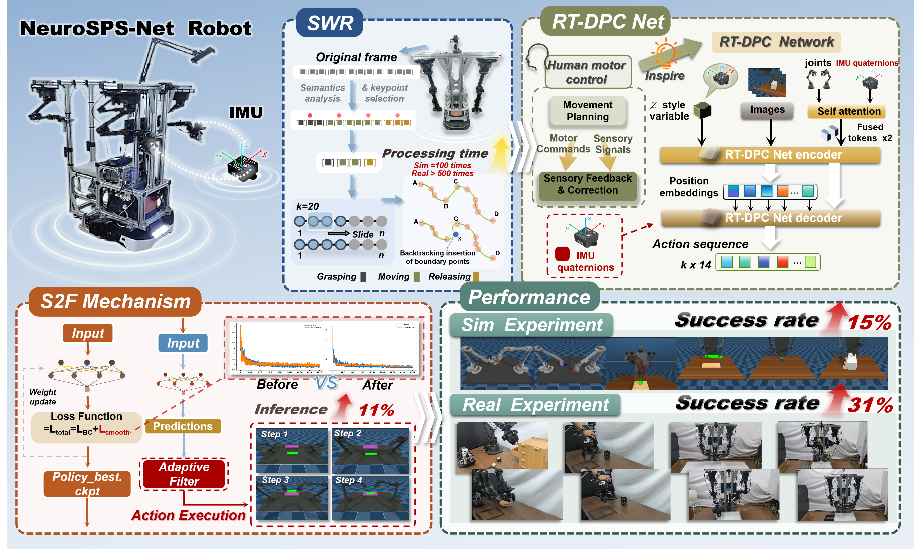

## <i class="fa-solid fa-user section-icon"></i> About Me

I am **Qian Li (李倩)**, an undergraduate student majoring in **Process Equipment and Control Engineering** at **Jiangnan University**, a Project 211 and Double First-Class university. I expect to receive my B.Eng. degree in June 2027.

I currently have a GPA of **3.57/4.0** and rank **3rd out of 70 students (Top 5%)** in my major. My research focuses on embodied intelligence, robot learning, vision-language-action models, robotic manipulation, and multimodal perception.

I have research experience in vision-language-action model adaptation, imitation learning, diffusion-policy-based robot control, visual-tactile robotic grasping, and low-human-involvement self-evolving robotic systems.

## <i class="fa-solid fa-microscope section-icon"></i> Research Interests

- **Embodied Intelligence and Robot Learning:** vision-language-action models, imitation learning, diffusion policies, and end-to-end robot policy learning
- **Robotic Manipulation:** dexterous manipulation, mobile manipulation, bimanual coordination, and robot grasping
- **Multimodal Perception:** visual-tactile perception, vision-language models, and multimodal robot decision-making
- **Self-Evolving Robotic Systems:** autonomous error detection, corrective feedback, lifelong learning, and low-human-in-the-loop adaptation

## <i class="fa-solid fa-bullhorn section-icon"></i> News

- **[Latest]** Our work **NeuroSPS** received an *Accept with Minor Revision* decision from *Neurocomputing*.
- **[Selected]** Won the **National First Prize** in the 17th Process Equipment Practice and Innovation Competition.
- **[Selected]** Participated in developing the **Chariot** mobile-manipulation data collection system and applying for a national invention patent.
- **[Selected]** Won national awards in multiple robotics and intelligent manufacturing competitions.

## <i class="fa-solid fa-graduation-cap section-icon"></i> Education

### Jiangnan University

**B.Eng. Candidate in Process Equipment and Control Engineering**  
*September 2023 – June 2027 (Expected)*

- **GPA:** 3.57/4.0
- **Ranking:** 3/70, Top 5%
- **Selected Coursework:** Principles of Machinery (95), Mechanical Design (97), Theoretical Mechanics (98), Probability Theory (95)
- **Language Qualifications:** CET-4 and CET-6

## <i class="fa-solid fa-robot section-icon"></i> Research Experience

### NeuroSPS: A Sensorimotor-Inspired Policy for Semantic, Proprioceptive, and Smooth Robotic Manipulation

**Neurocomputing · JCR Q1 · Impact Factor 6.7 · Accept with Minor Revision · Co-first Author**

[Project Page](https://qianli-1118.github.io/NeuroSPS.github.io/)
<figure class="project-figure">
  
  <figcaption>
    Overview of the NeuroSPS robot imitation learning framework.
  </figcaption>
</figure>
- Developed the **NeuroSPS** framework to address error accumulation and insufficient robustness against disturbances in robot imitation-learning policies.
- Proposed the **SWR downsampling algorithm**, reducing the computational complexity of trajectory downsampling from \(O(n^2)\) to \(O(kn)\).
- Processed a 1,500-frame simulation trajectory in only **7–8 seconds**, achieving a speedup of more than **1,000×** over the conventional AWE method.
- Developed the **RT-DPC-Net** architecture for closed-loop micro-correction during complex robot interactions.
- Designed the **S2F smoothing mechanism** to reduce action jitter during robot-policy inference.
- Evaluated the framework on **six MuJoCo simulation tasks** and **seven real-world dexterous manipulation tasks**.
- Achieved an average success rate of **70.2%**, representing a **23.5% improvement** over the ACT baseline.

### Chariot: Integrated Mobile-Manipulation Intelligent Data Collection System

**National Innovation Training Project · National Invention Patent under Substantive Examination · Second Student Author**

- Led the national-level innovation project **“Smart Companion Navigation: A Humanoid Elderly-Care Robot Based on Exoskeleton Teleoperation and Imitation Learning.”**
- Used the project outcomes to support an application for a national invention patent.
- Built a master–slave robotic-arm joint-mapping system based on **ROS**.
- Developed a coordinated control system integrating **IMU foot pedals** and a mobile chassis, enabling coordinated upper- and lower-body teleoperation.
- Collected high-fidelity expert demonstration data and trained end-to-end robot policies using methods such as **ACT** and **Diffusion Policy**.

### Review of Stable Robotic Grasping Based on Tactile Perception

**《机器人》 · Third Author**

- Systematically reviewed tactile sensing technologies and data-driven algorithms for stable robotic grasping.
- Analyzed the mechanisms and performance characteristics of mainstream tactile sensors.
- Summarized adaptive grasping pipelines based on **contact inference, state estimation, and instability recovery**.
- Surveyed and compared discriminative evaluation methods, reinforcement learning, generative policies, and end-to-end multimodal grasping strategies.

### ACLE: A Low-Human-Involvement Closed-Loop Self-Evolution Framework for Robotic Manipulation

**Co-first Author**

- Designed an **App-in-the-Loop corrective harness** to address the inability of open-loop robot policies to perform autonomous diagnosis, correction, and continual learning.
- Integrated end-to-end policy execution, asynchronous VLM monitoring, conventional control recovery, and dual-memory feedback mechanisms.
- Accumulated “failure–recovery” trajectories in a correction memory and used them to support policy retraining.
- Built a VLM error-memory mechanism indexed using **CLIP**, improving the reliability of visual error detection.
- Developed a closed-loop autonomous evolution workflow consisting of **execution, monitoring, correction, memory accumulation, and retraining**.
- Responsible for **VLA-Adapter deployment**, VLM monitoring-module deployment, prompt design, performance evaluation, CLIP-based visual matching, and VLM-related harness development.

## <i class="fa-solid fa-trophy section-icon"></i> Competition Awards

- **National First Prize**, 17th Process Equipment Practice and Innovation Competition, Undergraduate Division — *Core Member*
- **National Third Prize**, 5th Jiangsu College Intelligent Robot Creative Competition, Home-Robot Physical Track — *Team Leader*
- **National Third Prize**, 28th China Robot and Artificial Intelligence Competition, Robot Innovation Track — *Core Member*
- **Silver Award**, 2nd “XINJE Cup” National College Student Intelligent Manufacturing Innovation Competition — *Core Member*
- **Honorable Mention (H Award)**, Mathematical Contest in Modeling — *Modeler and Paper Writer*
- **Innovative Work**, 3rd National College Student Mechanics + X Innovation Practice Symposium — *Team Leader*

## <i class="fa-solid fa-medal section-icon"></i> Honors and Scholarships

- University Second-Class Comprehensive Scholarship
- Dexin Inspirational Scholarship
- Sangma Scholarship
- Top Ten Volunteer
- Outstanding Individual in Social Practice
- Outstanding Social Practice Team Leader
- Outstanding Student Officer of Zhishan College

## <i class="fa-solid fa-code section-icon"></i> Technical Skills

- **Programming:** Python, Lua, MATLAB
- **Deep Learning:** PyTorch, model pretraining, LoRA fine-tuning, and VLA model reproduction
- **Robot Learning:** imitation learning, diffusion policies, ACT, and end-to-end robot policy training
- **Robotics:** ROS, robotic-arm teleoperation, multimodal robot control, and real-robot experimentation
- **Engineering Tools:** SolidWorks, Ansys, Arduino, MATLAB, and CAD
- **Qualifications:** CAD Professional Skills Certificate, CET-4, and CET-6
